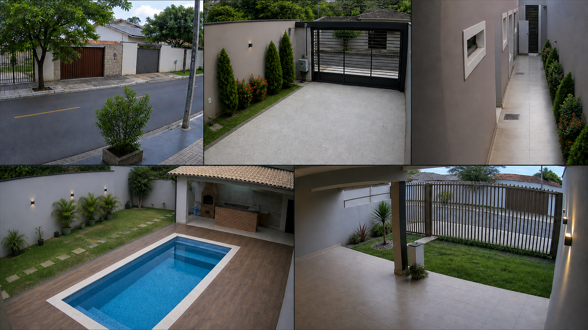

# Sentinela Cam TV

Sentinela Cam TV é um visualizador open-source de câmeras de segurança para Android TV e Google TV.

O aplicativo visualiza câmeras da rede local via RTSP direto e ONVIF, com mosaicos organizáveis, tela cheia, foto e gravações. O projeto prioriza privacidade, simplicidade e bom funcionamento em TVs e TV Boxes com hardware modesto.

## Principais recursos

- Mosaico adaptativo que não deforma a imagem.
- Até 3 mosaicos independentes, com até 15 slots em cada um.
- Tela cheia com troca direcional de câmera usando o mapa do mosaico.
- Descoberta e cadastro por ONVIF.
- Cadastro por URL RTSP direto.
- Suporte a DVR/NVR com múltiplos canais quando expostos por ONVIF.
- Alternância entre streams HD e SD.
- Modos `Menor latência` e `Estabilidade`.
- Captura de fotos e gravação de vídeos com áudio na tela cheia.
- Interface em português-BR, inglês, espanhol, turco, árabe e russo.
- Seletor de idioma dentro do aplicativo.
- Atualização manual e segura pelo GitHub Releases, com validação SHA-256.
- Exportação manual de logs para suporte.
- Navegação completa por controle remoto e D-Pad.

## Modos de transmissão

### Menor latência

Perfil otimizado para uma conexão local por **cabo Ethernet**. Usa buffers menores e tenta transmissão UDP primeiro para reduzir o atraso entre a câmera e a TV.

### Estabilidade

Perfil otimizado para **Wi-Fi 2,4 GHz**, ou conexões sujeitas a oscilações. Usa TCP e buffers maiores para priorizar continuidade, com um pouco mais de atraso.

## Compatibilidade atual

- Suporta câmeras via RTSP/ONVIF.
- ONVIF é usado para descoberta, autenticação e obtenção dos streams.
- DVRs e NVRs podem fornecer vários canais por um único cadastro ONVIF.
- No momento, o app não controla PTZ, zoom óptico, presets ou movimentação da câmera.
- O foco atual é visualização local, não administração completa do dispositivo.

## Privacidade

O Sentinela Cam TV não usa anúncios, rastreamento, analytics, telemetria, Firebase, Google Play Services ou nuvem obrigatória.

As câmeras são acessadas localmente. O aplicativo não envia imagens, credenciais ou dados das câmeras para servidores externos.

## Download

Baixe a versão mais recente em [GitHub Releases](https://github.com/nyankocore/SentinelaCamTV/releases/latest).

Use o APK da ABI do seu aparelho quando souber qual é. Se não souber, use o APK `universal`.

O arquivo `SHA256SUMS.txt` de cada release permite conferir a integridade dos APKs baixados.

## Suporte

Relatos de bugs podem ser enviados pelas [Issues](https://github.com/nyankocore/SentinelaCamTV/issues).

Os logs são exportados manualmente pelo usuário dentro do app. Nenhum log é enviado automaticamente.

## Estado do projeto

O app está em desenvolvimento ativo. Algumas funções ainda podem mudar, e o seu feedback é muito importante.

No momento, o projeto está em desenvolvimento individual. Relatos de bugs são bem-vindos pelas Issues, mas contribuições de código ainda não estão abertas.

## Licença

Sentinela Cam TV é software livre licenciado sob `GPL-3.0-or-later`.
